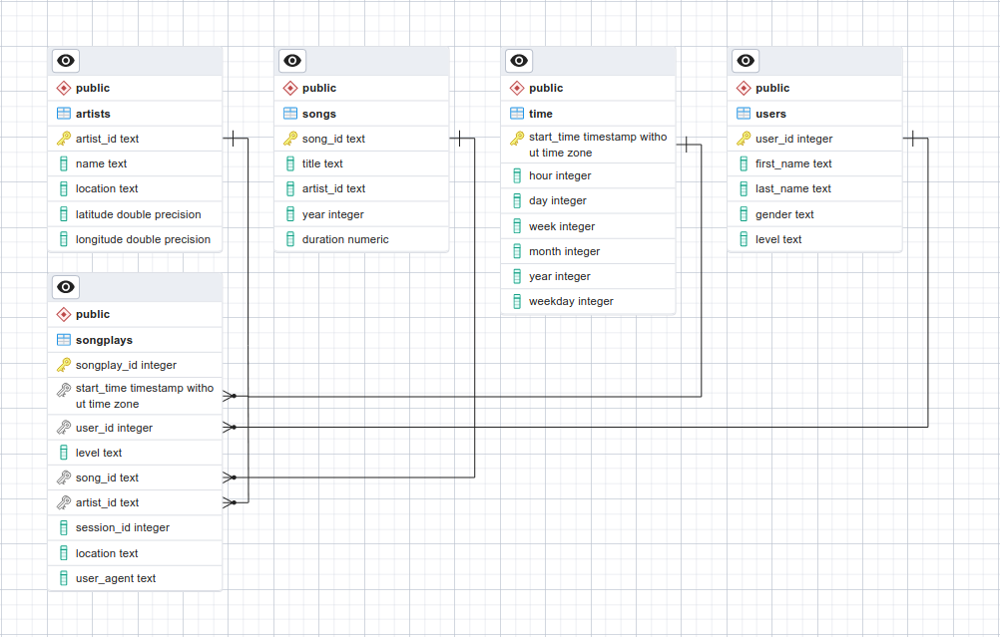

<div id="top"></div>

<!-- TABLE OF CONTENTS -->
<details>
  <summary>Table of Contents</summary>
  <ol>
    <li>
      <a href="#about-the-project">About The Project</a>
      <ul>
        <li><a href="#premise">Premise</a></li>
        <li><a href="#goal">Goal</a></li>
        <li><a href="#data">Data</a></li>
      </ul>
    </li>
    <li>
      <a href="#getting-started">Getting Started</a>
      <ul>
        <li><a href="#setting-up-a-conda-environment">Setting up a conda environment</a></li>
        <li><a href="#setting-up-a-local-apache-airflow-server">Setting up a local Apache Airflow server</a></li>
        <li><a href="#setting-up-an-amazon-redshift-cluster">Setting up an Amazon Redshift cluster</a></li>
      </ul>
    </li>
    <li><a href="#usage">Usage</a></li>
    <li><a href="#additional-notes">Additional Notes</a></li>
    <li><a href="#license">License</a></li>
    <li><a href="#contact">Contact</a></li>
    <li><a href="#acknowledgments">Acknowledgments</a></li>
  </ol>
</details>

# Sparkify (using Apache Airflow)

A project from the [Data Engineer Nanodegree Program at Udacity](https://www.udacity.com/course/data-engineer-nanodegree--nd027) to practice data pipelines using Apache Airflow as well as S3 buckets and Amazon Redshift.

## About The Project

### Premise

> A music streaming company, Sparkify, has decided that it is time to introduce more automation and monitoring to their data warehouse ETL pipelines and come to the conclusion that the best tool to achieve this is Apache Airflow.
>
>They have decided to bring you into the project and expect you to create high grade data pipelines that are dynamic and built from reusable tasks, can be monitored, and allow easy backfills. They have also noted that the data quality plays a big part when analyses are executed on top the data warehouse and want to run tests against their datasets after the ETL steps have been executed to catch any discrepancies in the datasets.
>
>The source data resides in S3 and needs to be processed in Sparkify's data warehouse in Amazon Redshift. The source datasets consist of JSON logs that tell about user activity in the application and JSON metadata about the songs the users listen to.

<p align="right">(<a href="#top">back to top</a>)</p>

### Goal

The goal of this project is to apply what I have learned on Apache Airflow to create my own custom operators to perform tasks such as staging the data, filling the data warehouse, and running checks on the data as the final step. The final airflow DAG should look similar to the image below.


<p align="right">(<a href="#top">back to top</a>)</p>

### Data

Data is stored in an S3 bucket in `us-west-2`:

- **Song data**: `s3://udacity-dend/song_data`
- **Log data**: `s3://udacity-dend/log_data`

#### The song dataset

A subset of real data from the [Million Song Dataset](http://millionsongdataset.com/). Each file is in JSON format and contains metadata about a song and the artist of that song. Files are located under in `s3://udacity-dend/song_data`.

For example, this is how the first file (`TRAAAAW128F429D538.json`) looks like:

```json
{
  "num_songs": 1,
  "artist_id": "ARD7TVE1187B99BFB1",
  "artist_latitude": null,
  "artist_longitude": null,
  "artist_location": "California - LA",
  "artist_name": "Casual",
  "song_id": "SOMZWCG12A8C13C480",
  "title": "I Didn't Mean To",
  "duration": 218.93179,
  "year": 0
}
```

#### Log dataset

It is composed of log files in NDJSON format generated by this [event simulator](https://github.com/Interana/eventsim) based on the songs in the dataset above. These simulate activity logs from a music streaming app based on specified configurations. Files are located under `s3://udacity-dend/log_data`.

The log files are named following a date pattern (`{year}_{month}_{day}_events.json`), and below is the first line of the first file (`2018-11-01-events`) as an example:

```json
{
  "artist": null,
  "auth": "Logged In",
  "firstName": "Walter",
  "gender": "M",
  "itemInSession": 0,
  "lastName": "Frye",
  "length": null,
  "level": "free",
  "location": "San Francisco-Oakland-Hayward, CA",
  "method": "GET",
  "page": "Home",
  "registration": 1540919166796.0,
  "sessionId": 38,
  "song": null,
  "status": 200,
  "ts": 1541105830796,
  "userAgent": "\"Mozilla/5.0 (Macintosh; Intel Mac OS X 10_9_4) AppleWebKit/537.36 (KHTML, like Gecko) Chrome/36.0.1985.143 Safari/537.36\"",
  "userId": "39"
}
```

<p align="right">(<a href="#top">back to top</a>)</p>

### Data Schema

The new tables follow a star schema that is better visualized through an Entity Relationship Diagram (ERD). The following image shows the ERD of an example PostgreSQL database with the final tables defined.



Here, *songplays* is a **fact table**, whereas *artists*, *songs*, *time* and *users* are **dimension tables**. These tables make it easy to query relevant information with few joins.

<p align="right">(<a href="#top">back to top</a>)</p>

## Getting Started

To make use of this project, I recommend managing the required dependencies with Anaconda.

### Setting up a conda environment

Install miniconda:

```bash
wget https://repo.anaconda.com/miniconda/Miniconda3-latest-Linux-x86_64.sh
bash Miniconda3-latest-Linux-x86_64.sh
```

Install mamba:

```bash
conda install -n base -c conda-forge mamba
```

Install environment using provided file:

```bash
mamba env create -f environment.yml # alternatively use environment_core.yml if base system is not debian
mamba activate sparkify_airflow
```

### Setting up a local Apache Airflow server

To start a local Apache Airflow server for the purposes of this project, simply run the following:

```bash
bash initialize_airflow.sh
```

Introduce your desired password when prompted and then access the UI at `localhost:8080` with user `admin` and the password you just created.

### Setting up an Amazon Redshift cluster

**Create an IAM user:**

  1. IAM service is a global service, meaning newly created IAM users are not restricted to a specific region by default.
  2. Go to [AWS IAM service](https://console.aws.amazon.com/iam/home#/users) and click on the "**Add user**" button to create a new IAM user in your AWS account.
  3. Choose a name of your choice.
  4. Select "**Programmatic access**" as the access type. Click Next.
  5. Choose the **Attach existing policies directly tab**, and select the "**AdministratorAccess**". Click Next.
  6. Skip adding any tags. Click Next.
  7. Review and create the user. It will show you a pair of access key ID and secret.
  8. Take note of the pair of access key ID and secret. This pair is collectively known as Access key.

**Save access key and secret locally:**

  1. Create a new file, `_user.cfg`, and add the following:

      ```bash
      AWS_ACCESS_KEY_ID = <YOUR_AWS_KEY>
      AWS_SECRET_ACCESS_KEY = <YOUR_AWS_SECRET>
      ```

  2. This file will be loaded internally to connect to AWS and perform various operations.
  3. **DO NOT SHARE THIS FILE WITH ANYONE!** I recommend adding this file to .gitignore to avoid accidentally pushing it to a git repository: `printf "\n_user.cfg\n" >> .gitignore`.

**Create cluster:**

  1. Fill the `dwh.cfg` configuration file. These are the basic parameters that will be used to operate on AWS. More concretely, `GENERAL` covers general parameters, `DWH` includes the necessary information to create and connect to the Redshift cluster and S3 contains information on where to find the source dataset for this project. *This file is already filled with example values*.
  2. To create the Redshift cluster, simply run the `setup.py` python script (must be done after `initialize_airflow.sh`, since registration of connections is also taking place in `setup.py`).

<span style="color:red;font-weight:bold">*DO NOT FORGET TO TERMINATE YOUR REDSHIFT CLUSTER WHEN FINISHED WORKING ON THE PROJECT TO AVOID UNWANTED COSTS!*</span>

<p align="right">(<a href="#top">back to top</a>)</p>

## Usage

Project structure:

- `src/dags`: Airflow dags.
- `src/plugins`: Airflow custom plugins and operators.
- `src/*.py`: Utility scripts and functions.

Ensure you have set the `PYTHONPATH` environment variable as needed (e.g., `PYTHONPATH=~/sparkify_airflow/src`)

The whole project can be run as follows:

```bash
bash initialize_airflow.sh && python src/setup.py
```

<p align="right">(<a href="#top">back to top</a>)</p>

## Additional Notes

Source files formatted using the following commands:

```bash
isort .
autoflake -r --in-place --remove-unused-variable --remove-all-unused-imports --ignore-init-module-imports .
black .
```

## License

Distributed under the MIT License. See `LICENSE` for more information.

<p align="right">(<a href="#top">back to top</a>)</p>

## Contact

[Carlos Uziel Pérez Malla](https://www.carlosuziel-pm.dev/)

[GitHub](https://github.com/CarlosUziel) - [Google Scholar](https://scholar.google.es/citations?user=tEz_OeIAAAAJ&hl=es&oi=ao) - [LinkedIn](https://at.linkedin.com/in/carlos-uziel-p%C3%A9rez-malla-323aa5124) - [Twitter](https://twitter.com/perez_malla)

<p align="right">(<a href="#top">back to top</a>)</p>

## Acknowledgments

This README includes a summary of the official project description provided to the students of the [Data Engineer Nanodegree Program at Udacity](https://www.udacity.com/course/data-engineer-nanodegree--nd027).

<p align="right">(<a href="#top">back to top</a>)</p>
